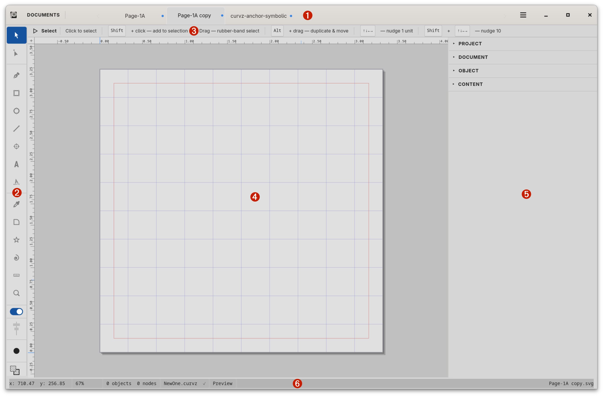

# Curvz

Professional vector icon editor for Linux, built with GTK4. Designed to produce
clean SVG icons — including `currentColor`-aware symbolic glyphs suitable for
embedding in GTK applications and other contexts where icons should follow the
host theme.



## Status

Curvz is in active development. The core editor is feature-complete and usable
day-to-day for icon work, but the project is still pre-1.0 — expect rough
edges, occasional bugs, and changes in undocumented behaviour. The in-app
manual (Help menu) is the most current source of truth for what's stable.

## Features

- Pen, node, rectangle, ellipse, polygon, spiral, line, and text tools
- Boolean path operations — Union, Subtract, Intersect (Clipper2-backed)
- Compound paths, blends, clip masks, warps
- Multi-document interface with project files (`.curvz`) and templates
- Reusable swatches, styles, and themes
- `currentColor`-aware SVG output for embedding
- Configurable rulers, guides, grids, and snapping (with hotkey-toggled snap)
- Full undo/redo with command coalescing
- Macro recording and playback

## Building from source

### Dependencies

**Fedora:**
```
sudo dnf install gtkmm4.0-devel cairomm1.16-devel pangomm2.48-devel \
                 freetype-devel fontconfig-devel \
                 nlohmann-json-devel spdlog-devel libpng-devel \
                 cmark-devel clipper2-devel \
                 cmake clang pkgconf-pkg-config
```

**Ubuntu / Debian:**
```
sudo apt install libgtkmm-4.0-dev libcairomm-1.16-dev libpangomm-2.48-dev \
                 libfreetype-dev libfontconfig1-dev \
                 nlohmann-json3-dev libspdlog-dev libpng-dev \
                 libcmark-dev \
                 cmake clang pkg-config
```

The bundled `build.sh` will install Ubuntu dependencies automatically if
`apt-get` is detected; Fedora users should install manually using the line
above.

> **Note on Clipper2 and cmark:** if your distribution doesn't ship a
> recent `clipper2-devel` / `libcmark-dev` package (Ubuntu LTS releases
> typically don't yet have Clipper2), CMake will fall back to fetching
> and building these as part of the Curvz build via `FetchContent`. This
> works without intervention — it just adds a one-time download and a
> few extra minutes to the first clean build. Installing the system
> packages (where available) is faster and lets multiple projects share
> the libraries.

### Build

```
./build.sh
```

This produces `./build/curvz` — runnable directly for development.

### Install

To register Curvz with the desktop environment (launcher entry, MIME type for
`.curvz` files, application icon):

```
sudo cmake --install build --prefix /usr/local
```

After installation, Curvz appears in your application launcher and `.curvz`
files open in Curvz when double-clicked.

## Documentation

The primary user documentation lives inside the application — open Curvz, then
**Help → Manual** (or press `F1`). The manual covers the workspace, every tool,
the inspector, color management, themes, macros, and troubleshooting.

## Platform support

Curvz is developed and tested on Fedora aarch64. It is expected to build and
run on any modern Linux distribution with GTK 4.10 or later. Other platforms
have not been tested.

## License

Curvz is licensed under the GNU General Public License v3.0 or later. See
[LICENSE](LICENSE) for full terms.

## Contact and support

- **Bug reports and feature requests** —
  [GitHub Issues](https://github.com/curvz/curvz/issues). Public, gives
  the bug a permanent home, and lets others see whether their problem
  has already been raised.
- **General contact** — `curvz.app@proton.me`. For non-bug questions
  or anything you'd rather not file publicly.

## Project status and handover

Curvz is currently maintained by a single developer as a side project. The
codebase is structured for handover — well-commented, conventional CMake +
GTK4 idioms, no exotic dependencies — and the GPL-3.0 license keeps it free
for any future maintainer or fork. If you'd like to contribute or take on
maintenance, open an issue to start the conversation.
