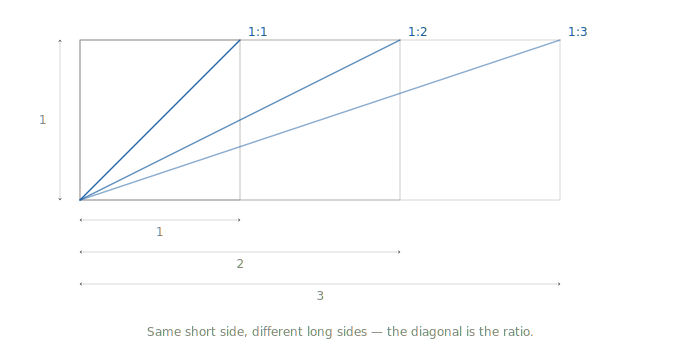

# How Curvz thinks about size

## The plane and the page

Curvz draws on a plane, not on paper. The numbers on the canvas — 1000, 16,
24, 256 — are a ratio, not a measurement. Nothing in your drawing is any
particular size until the moment you export it, and that moment is the only
one where physical size matters. Until then you are working in pure
proportion: relationships between shapes, distances, curves. Once you see
this, a great deal of Curvz starts to make sense.

## Designing in ratios

This way of thinking is older than computers. Drafting students used to
learn it with a proportion wheel — a small plastic disk that let them turn
any object, of any size, into a ratio that fit on a sheet of vellum.
Architects, engineers and illustrators have always worked this way, because
the alternative — drawing everything at its real-world size — is
impractical the moment your subject is larger than your hand or smaller than
a coin. Vector graphics inherited this idea directly. PostScript, and
its smaller sibling SVG, describe a drawing as a *plane* of mathematical
relationships; the physical size is not realized until it is rendered.

Raster editors work differently. In a raster application like Photoshop
the canvas number *is* the size — a 16×16 image is sixteen pixels across,
full stop, and that number is both the working space and the final output.
In a vector tool the canvas number is a proportion, and treating it as a
fixed size will quietly defeat your purpose. Tools have a minimum useful
precision — a handle that lands on a half-pixel becomes a handle that lands
on a whole one, and the curve suffers. Boolean operations have a quality
coefficient — unioning a circle with a square at 16-unit resolution gives
you a chunky result, because there are only so many places the algorithm
can put a point. None of these are bugs in the tool. They are what happens
when the plane is too small for the algorithm to work.

## Working at scale

The way through is to give yourself room. Design at a scale that lets the
tools perform. Let the export step handle the physical size.

For a 16×16 icon, set the canvas to 1000×1000. Same proportions — a square
is still a square, a centered shape is still centered — but every tool now
has a thousand units of precision instead of sixteen. Snap to grid means
something. Boolean unions come back clean. Handles can be placed where the
eye wants them, not where the integer grid forces them. When the drawing is
ready, export to 16×16 px. Curvz does the normalization for you; the SVG
that comes out is small, clean, and accurate to the drawing you made.

The 1000×1000 number is not magical — 256, 512, and 2048 all work the
same way. The point is that you are choosing a working scale generous
enough to design in, and a delivery scale appropriate to where the icon
will live.

This pattern carries to anything else you draw in Curvz. A 24×24 toolbar
icon. A 256-pixel app icon. A logomark that has to render at a favicon
size and a billboard, sized from the same file. In every case the answer is
the same: design large, normalize on export. The drawing is the same
drawing; only the rendering changes.

## A small habit, a large payoff

A small habit learned early pays back continuously in the long haul. The tools
that felt cramped will feel comfortable. Boolean operations will produce results
worth keeping. Exports will be smaller and cleaner because the drawing they
came from was made at a scale that left room for it to be balanced. None of
this requires you to think about ratios *while* you draw — only once, at
the moment you set up a new document. Then you draw the way you always
wanted to, and let Curvz do the arithmetic on the way out.

This is how Curvz wants to be used. Once the idea clicks, you will not want to
go back.
