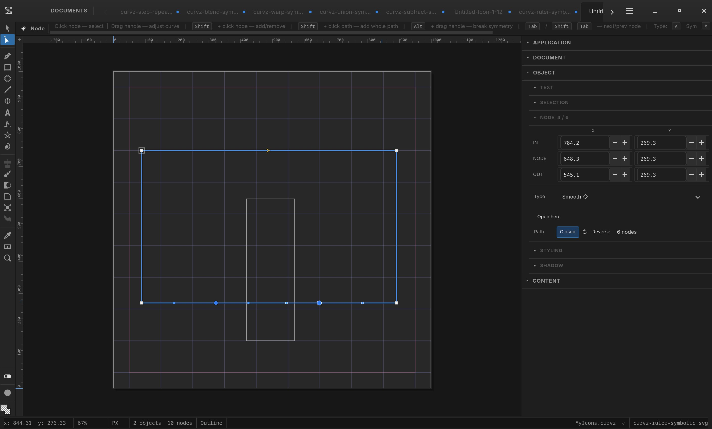
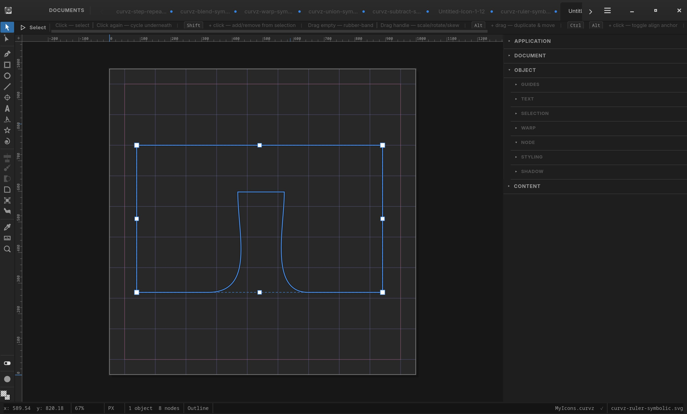
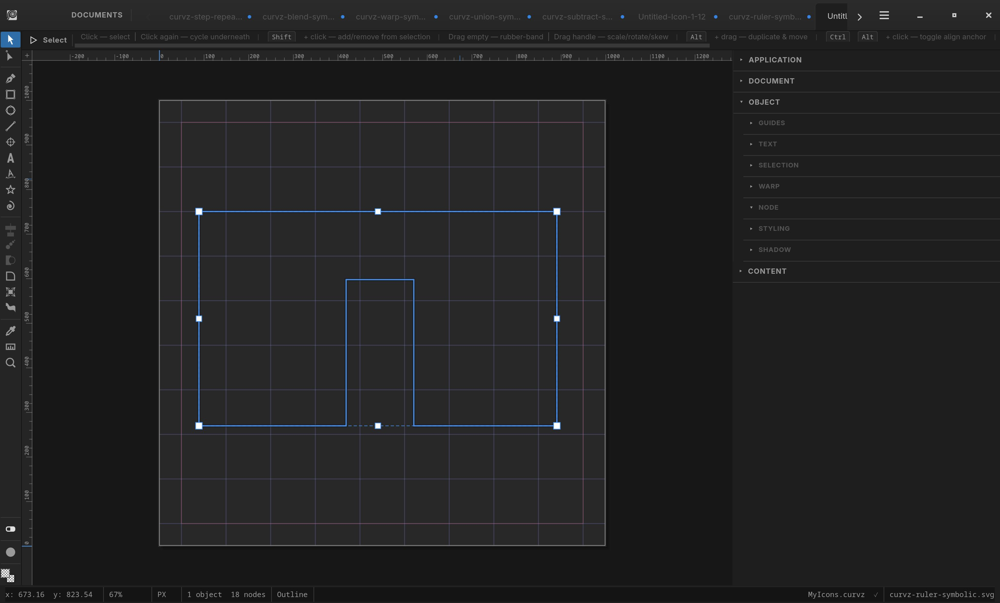

# Workflow strategies

The tools in Curvz are individually documented in the chapters
ahead of this one — what each does, where its controls live,
how to drive it. This chapter is different. It collects
**workflows** — sequences of tools used together — that solve
real design problems in ways the individual tool docs don't
make obvious.

These aren't the only ways to use Curvz, and they're not
prescriptions. They're patterns worth knowing about, because
some of them turn into nightmares in other vector apps and stay
short and clean here. The why-it-works notes are short and
explain the underlying design choice that makes each workflow
fast.

This chapter grows over time. Each strategy is short, named, and
self-contained — read the ones that match what you're trying to
do, skip the rest.

## Round any corner of any path

**The problem.** You want to round selected corners — three of
four corners on a rectangle, only the points of a star, only the
sharp turns of a hand-drawn polygon — without rounding the
others.

**Most apps make you fight their model.** Round-corner widgets
in Illustrator and Affinity work on bounding-box corners or on
"live shape" objects (rectangles, polygons), not on arbitrary
geometry. Rounding three of four corners on a rect means
exporting the corner radius as a path, manually editing nodes,
or using a complicated effects pipeline.

**The Curvz workflow.**

1. Activate the **Corner tool** (4.8 — keyboard **K**).
2. Click or shift-click to select the specific Corner/Cusp
   nodes you want rounded. Marquee-select for many at once.
3. Set the radius. Click Apply.

That's it. The treatment runs only on the picked nodes. Smooth
and Symmetric nodes — anywhere on any path — are skipped
automatically.

**Why it works.** The Corner tool selects **nodes**, not shapes.
Whether you started with a rectangle, polygon, freeform path, or
imported SVG doesn't matter — if there's a sharp corner anywhere
in your selection, it's a candidate for the treatment. The tool
doesn't care how the path got that corner; it only cares that
the corner exists.

> 

## Rotate, measure, correct

**The problem.** You eyeballed a rotation, then realised the
result is *almost* parallel to the X or Y axis but not quite —
maybe a couple of degrees off. You want to snap it to true
horizontal or vertical without doing math.

**Most apps make this fiddly.** The rotation field shows the
angle relative to the object's transform matrix, the measure
tool reads angles relative to the canvas, and the two don't
share a workflow. Reconciling them means computing the
correction by hand, or rotating in tiny increments until the
visual looks right.

**The Curvz workflow.**

1. Rotate the object by eye to roughly the orientation you want
   (Selection tool, drag a corner rotation handle).
2. Switch to the **Measure tool** (4.6.3 — keyboard **M**) and
   measure along the edge that should be parallel to an axis.
   The angle reads in the Inspector.
3. Read the angle off the measurement (e.g. "−2.4° from
   horizontal").
4. Activate the rotation field in the Inspector and apply the
   correction (in this example: **rotate by +2.4°**).

The object is now true-parallel to the axis you measured against.

**Why it works.** Curvz mutates path geometry directly when
you rotate, rather than stacking a transform on top of the
object. The angle the Measure tool reports is the *real* angle
of the segment in the document, and the rotation field operates
on that same geometry. Negate, type, done — no math needed,
because there's no transform stack to reconcile.

> 

## Sharp boolean results from corner-looking paths

**The problem.** You ran Subtract (or Union, or Intersect) on
what looked like two rectangles, expecting a clean rectangular
result, and got rounded curves where the corners should be. The
shapes look like rects on the canvas, but the boolean rounded
them anyway.

**The cause is invisible at first glance.** Boolean operations
work from each anchor's tangent vector, not from the visual
silhouette. A path can *look* like sharp corners — straight
edges, square turns — while one or more of its nodes are typed
**Smooth** or **Symmetric** with non-zero handles. The handles
are hidden until you switch to the Node tool. When the boolean
op enriches geometry at the participating anchors, those handles
carry through into the output as curve segments. The result has
sharp corners where the originals had **Corner**/**Cusp** nodes,
and rounded corners where they had **Smooth**/**Symmetric**
nodes — even if the visible shape gave no warning.

**The Curvz workflow.**

1. Switch to the **Node tool** (4.2.2 — keyboard **N**) and
   inspect the path. Smooth/Symmetric nodes show extended
   handles; Corner/Cusp nodes show no handles or retracted ones.
2. Select the offending nodes — marquee or shift-click.
3. Press **Ctrl+Left** to retract the IN handles, **Ctrl+Right**
   to retract the OUT handles. Symmetric nodes retract both
   regardless of side. (See 4.2.2 for the full multi-select
   retract gesture.)
4. Switch to the **Selection tool** and run the boolean op. The
   result has the corners you expected.

**Why it works.** Curvz keeps node *type* and node *handles* as
independent state — a Smooth node with handles retracted to its
anchor is geometrically identical to a Corner, and the boolean
engine treats them the same way. Retracting handles before the
op is the structural fix; converting node types after the op is
fighting the symptom. The handles are what the math reads, so
the handles are what you change.

**❶ Before — looks like a rect.** Six nodes; bottom two are
*Smooth* with extended handles. Visually indistinguishable from
a Corner-only rect at this zoom.

**❷ After Subtract — rounded bite.** The bottom edge collapses
into curved walls because the boolean carried the smooth
tangents of nodes 4 and 5 into the output.

**❸ Fix — handles retracted.** Ctrl+Left + Ctrl+Right on the
selected pair zeroes the IN/OUT handles to the anchor. Node
types unchanged; the geometry is now corner-equivalent.

**❹ After Subtract again — clean slot.** Same op, same operands,
sharp corners — because the math now reads zero-length tangents
at the participating anchors.

## More strategies coming

This chapter is incomplete on purpose — strategies get added as
they become clear. Patterns to watch for and write up later
include:

- **Pen, then refine** — sketch a path with the Pen tool, then
  refine handle types (Corner, Cusp, Smooth, Symmetric) with the
  Node tool's type-toggle controls.
- **Style first, color last** — bind a stroke/fill style early
  so changes to the style propagate to every object using it,
  rather than colouring objects individually and reconciling
  later.
- **Refpts as construction lines** — drop reference points
  before drawing to scaffold proportions and snap targets.
- **Boolean as part of design, not cleanup** — using union/
  subtract/intersect to *describe* a shape rather than to fix
  one after the fact.

If you find a Curvz workflow that's notably faster than the
equivalent in another tool, that's a candidate for this chapter.
Help authors and users alike are encouraged to add to it.
