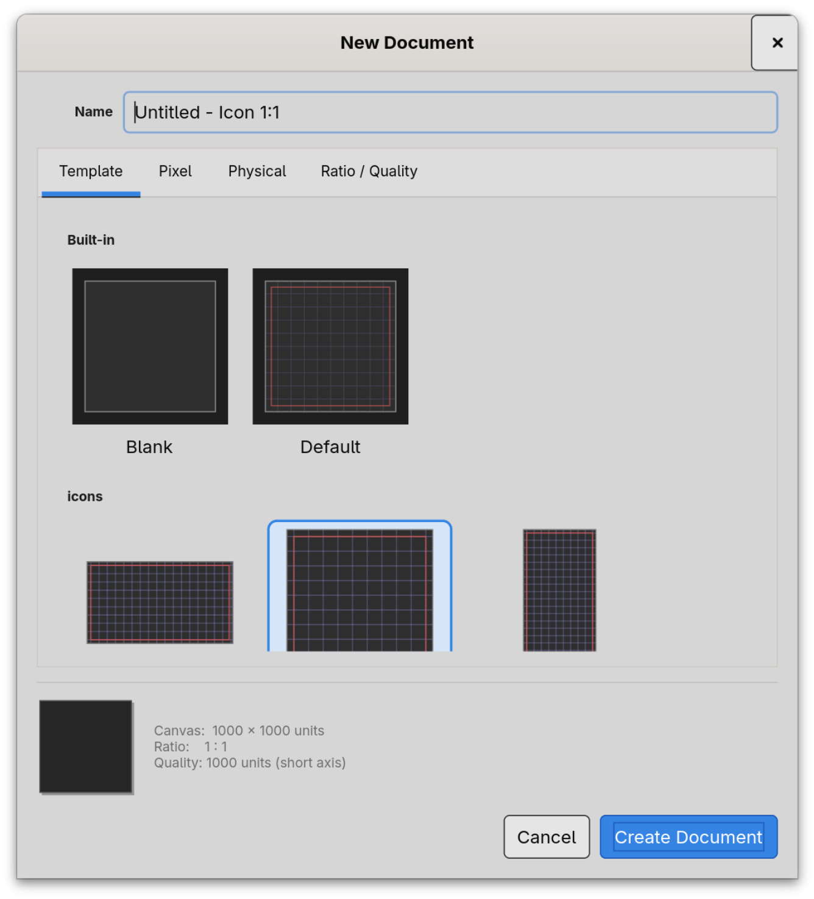

# Templates

Every new document starts from a **template**. A template is a
saved seed — a starting canvas, a starting grid, optional margins,
and any starter geometry — that you reach for when you say "make me
another one of these."

Templates are **user-global**: they live in your home directory, not
inside any one project, and they are available no matter which
project you are working in.



## Two built-in templates

Curvz ships with two non-removable templates:

- **Blank** — an empty canvas at whatever size you specify. No
  grid, no margins, no starter geometry. Use this when you want a
  clean slate at a specific dimension.
- **Default** — Curvz's recommended icon-design starting point: a
  square canvas with a 10-division grid on the short axis, a
  half-cell margin on all four sides, and the grid origin offset by
  half a cell so a grid cell centres on the margin line. The
  proportions scale with whatever canvas size you choose.

These two are presented in the New Document dialog under the
**builtin** category and are always available. They cannot be
renamed, deleted, or moved.

## User templates

Beyond the built-ins, any document you have made can be saved as a
template through **File → Save as Template…**. The dialog asks for:

- **Name** — what shows up in the New Document dialog.
- **Category** — a folder for grouping related templates. You can
  create new categories on the fly or pick from existing ones.
- **Description** (optional) — a short note that appears as a
  tooltip in the gallery.

Saving snapshots the active document — its canvas size, layers,
guides, grid settings, and any geometry you've drawn — into a
template bundle and registers it for future use.

User templates live at `~/.config/curvz/templates/`. Each template
is its own directory containing:

```
~/.config/curvz/templates/<category>/<slug>/
  template.svg          — the seed document
  template.json         — the metadata (name, category, description)
  thumbnail-dark.png    — gallery thumbnail, dark motif
  thumbnail-light.png   — gallery thumbnail, light motif
```

Templates render two thumbnails so the gallery can match the active
motif. Older templates with a single `thumbnail.png` continue to
work and are read as a fallback.

The slug is derived from the name (lowercased, alphanumerics only,
spaces become hyphens). Two templates with names that collide on
slug get a numeric suffix.

## System templates

If Curvz finds templates under `/usr/share/curvz/templates/` (a
distribution-installed location), they appear in the gallery
alongside your user templates. System templates are read-only —
the gallery shows them but Manage Templates won't rename, move, or
delete them. They behave like extra built-ins.

## Manage Templates

**File → Manage Templates…** opens the management dialog. From
there you can:

- **Rename** a template, which updates both its name and its slug.
- **Move** a template between categories.
- **Delete** a template.
- **Create, rename, or delete user categories.**
- **Star a default** — the starred template is pre-selected in the
  New Document dialog. The star is your project-independent
  preference; clear it any time and the New Document dialog falls
  back to highlighting **Default**.

Mutating operations refuse to touch the system root. Built-in
templates and system-installed templates are visible in the manager
but their controls are greyed out.

## Where to next

- **Projects and documents** (2.1) covers the project that wraps
  your documents.
- **Import & export** (2.3) covers the other ways content moves
  into and out of Curvz besides the New Document dialog.
