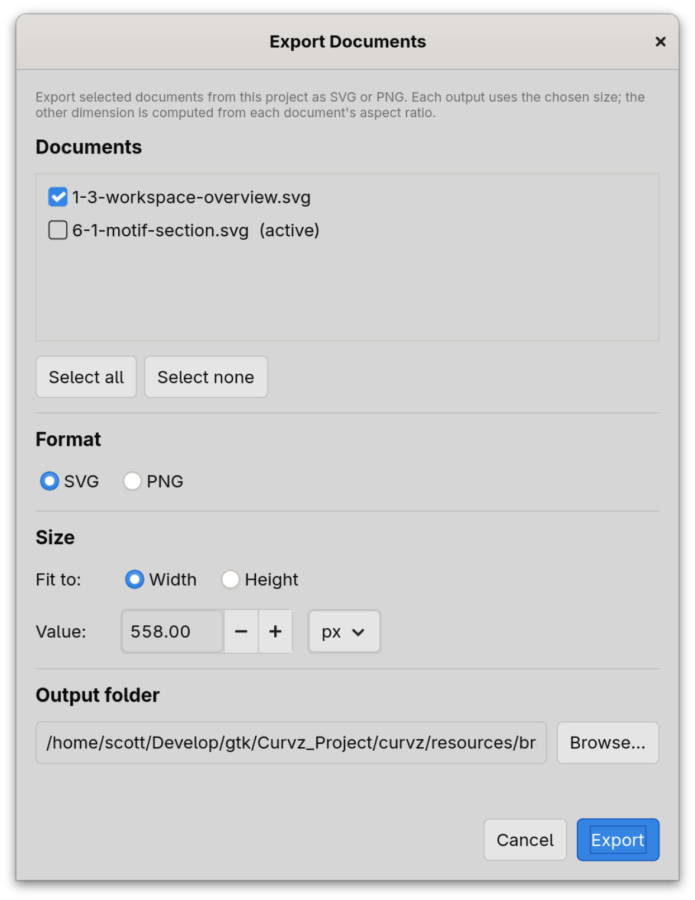

# Import and export

This page covers every way content moves into or out of a Curvz
project — beyond the New Document dialog (which is its own
template-driven path; see **Templates** (2.2)).

## Importing

Three import paths, all under **File**:

### Import SVG (Ctrl+I)

Brings an existing SVG file in as a **new document** in the active
project. Geometry is preserved verbatim — the document's canvas
inherits the source SVG's dimensions, paint values keep their
original colours, and any units the source declared survive into
the new document.

Use this when the source already follows the conventions you want
(typical case: re-importing an SVG that Curvz itself wrote, or
bringing in artwork from a colleague who uses the same standards).

### Import as Icon (Ctrl+Alt+I)

Same picker as Import SVG, but with two transformations applied:

- The long axis is **rescaled to 1000 units** and the short axis
  scaled in proportion. Inside Curvz every imported icon ends up at
  the same internal scale, regardless of how the source was
  authored.
- Every solid fill and stroke is **converted to `currentColor`**.
  The icon picks up its colour from whatever theme is rendering
  it, not from baked-in paint values. See **currentColor and
  symbolic icons** (9.2) for why that matters.

Use this for incoming SVGs from non-Curvz sources — open icon
sets, freebies, hand-offs from designers using other tools. The
result is a document that feels native to your project.

### Place Image

Embeds a raster image (PNG, JPEG, GIF, WebP) onto the **active
document's canvas** as an image object. The image lives inside the
SVG as a `<image>` element with a base64-encoded data URI, which
means the project remains self-contained — no external file
references that can break.

Place Image is a placement, not an import: it doesn't create a new
document, and it doesn't trace the bitmap. Use it as a reference
underlay you can draw over with vector tools.

A second variant, **File → Open Image**, uses the same picker but
resizes the document's canvas to the image's pixel dimensions and
places it at the origin at 1:1. Useful when the bitmap is your
intended sketch and you want the canvas sized to match.

## Exporting

Curvz writes vector and raster output through three different
paths, each suited to a different need.

### Save (Ctrl+S)

The everyday "write my work to disk" action. **Save** is not really
an export — it writes the project back to its `.curvz` directory in
Curvz's own format. The individual `.svg` files Curvz writes are
themselves fully valid SVG and can be opened in any other vector
tool, but they carry `data-curvz-*` metadata attributes that other
tools will preserve quietly without touching them.

If you only need one icon out of the project as a portable file,
the simplest path is to grab the matching `.svg` straight out of
the project directory.

### Export Documents (Project → Export Documents…)

For batch flat-file output. The dialog lets you:

- **Pick which documents** to export — every document in the
  project is listed with a checkbox; the active document is
  pre-ticked.
- **Choose a format** — SVG or PNG.
- **Choose a size** — fit to width or fit to height, with a value
  + units control (px, mm, in, pt). PNG export lets you set DPI;
  SVG ignores DPI but stamps the size intent into
  `data-curvz-export-*` attributes for downstream tools that
  understand them.
- **Pick an output folder** — files are written as
  `<doc-filename>.<ext>`, with collision suffixes ` (2)`, ` (3)`
  appended where needed.

Export Documents is the right path for "I want loose files for
each icon at this size."

### Export Icon Theme (File → Export Icon Theme…)

Writes a full **freedesktop icon theme** bundle — the directory
layout that desktop environments recognise (`hicolor`-style with
`scalable/<category>/<icon>.svg`). The dialog asks for a theme name
and comment, lets you pick which documents to include (each
document needs a name and a category to be eligible), and writes
out the bundle.

This is the path designed for the actual end-state of icon design
on Linux: shipping a usable theme that GTK applications can resolve
icons from.

### Print

**File → Print** hands the active document to the system print
dialog. It is here for completeness — printed icons aren't a
typical workflow — but the path uses Cairo's PDF backend so what
you get on paper matches what you see on canvas.

## Round-trip discipline

Curvz aims to round-trip its own output cleanly: export an SVG and
re-import it (via Import SVG) and you should get the same document
back, including node types, layer structure, and any non-rendered
metadata. The `data-curvz-*` attributes on the root `<svg>` and on
individual elements are how that fidelity is preserved.

Round-tripping through other tools is best-effort: most editors
preserve the data attributes silently, but they may rewrite the
geometry in subtly different ways. If you import an SVG that has
been through another editor, expect some smoothing of node types
and a need to re-touch any `currentColor` paint that may have been
baked back into a colour.

## Where to next

- **Templates** (2.2) covers the New Document path — the other
  way fresh content enters a project.
- **currentColor and symbolic icons** (9.2) explains why the
  Import as Icon transform matters, and what to do with the result.
