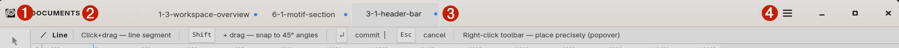

# Header and Document tabs

The header is the strip across the top of the window. It hosts the
app logo, the **Documents** label and tab strip, and the application
menu button. It is the only part of Curvz's chrome that runs the full
width of the window at all times — everything else moves out of the
way when you resize.

## ❶ Logo

The far-left button is the Curvz logo. Click it to open the **About**
dialog — version, author, attribution to the libraries Curvz depends
on, and a flip-side credits view.

## ❷ Documents label

Right of the logo is the word **Documents** with a vertical
separator after it. The label is more than decoration:

- **Right-click** the label to add a new document to the project,
  same as **File → Add to Project…** (or **Ctrl+N**).

The label exists because the tab strip itself can be empty (a
brand-new project starts with one default document but you can
remove it). Without the label, an empty strip would be hard to
right-click. The label always sits in the same place.

## ❸ Document tabs

The tab strip runs from the Documents label to wherever the menu
button starts. Each tab is one document in the active project.

- **Click** a tab to make that document active. The canvas, the
  layer stack, and the inspector's Document and Object groups all
  switch to the clicked document. The Application group and the
  project-wide content panels (Library, Swatches, Styles, Themes)
  do not change.
- **Right-click** a tab for its context menu:
  - **New Document** — same as the Documents-label right-click.
  - **Remove This Document** — removes the document from the
    project. The on-disk `.svg` file is deleted on the next save.
- **Drag** a tab horizontally to reorder it within the strip.

When more tabs exist than fit the available width, scroll chevrons
appear at the strip's left and right edges. Click a chevron to
scroll the strip; the active tab always tries to stay in view.

A tab's label comes from the document's filename (minus the `.svg`
extension). Renaming a document — either through the Documents
gallery in the inspector (see 6.6) or through the inspector's
Metadata section (5.3.1) — updates the tab label live.

### Switching documents from the keyboard

The tab strip pairs with two keyboard shortcuts that work from
anywhere in the window:

- **Ctrl+Tab** or **Ctrl+PgDn** — Next document
- **Ctrl+Shift+Tab** or **Ctrl+PgUp** — Previous document

Both wrap at the ends of the strip. The same actions live under
**Navigate** in the menu.

## ❹ Hamburger menu

The far-right **☰** button opens the application menu. It contains
every top-level action Curvz supports, organised into submenus —
File, Edit, Arrange, Align, Path, View, Navigate, Developer — plus
Help, Keyboard Shortcuts, and Quit at the bottom. See **Menus** (3.2)
for the full breakdown.

## Where to next

- **Menus** (3.2) walks every submenu and what's in it.
- **Projects and documents** (2.1) explains how the project wraps
  the documents you see as tabs.
- **Documents** (6.6) is the inspector panel where documents are
  managed in bulk — thumbnail gallery, drag-to-reorder, rename,
  duplicate.
