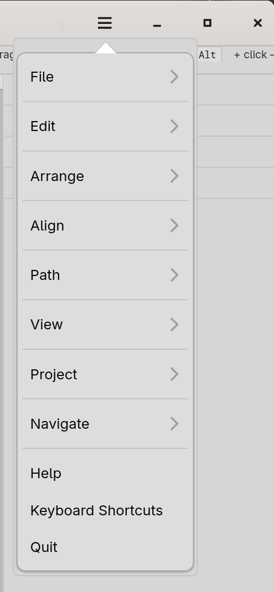

# Menus

The application menu lives behind the **☰** button at the far right
of the header bar. It contains every top-level action Curvz
supports, grouped into submenus.

The menu is the canonical place to find an action. Most actions
also have a keyboard shortcut, listed beside the menu item. Some
actions appear in **two** places — for example, **Themes…** lives
under Project but also opens the dialog covered in 9.1; this is
deliberate, not duplication.

## Submenus, top to bottom

- **File** — project lifecycle (New, Open, Save, Save As, Close),
  document lifecycle (New, Open Image, Save as Template, Manage
  Templates), and the import/export paths (Import SVG, Import as
  Icon, Place Image, Export Icon Theme, Print). See chapters 2.1,
  2.2, and 2.3.
- **Edit** — the conventional edit verbs (Undo, Redo, Cut, Copy,
  Paste, Duplicate, Duplicate in Place).
- **Arrange** — z-order operations (Bring to Front, Bring Forward,
  Send Backward, Send to Back) and per-axis flips (Flip Horizontal,
  Flip Vertical).
- **Path** — vector operations grouped into sections: boolean
  (Union, Subtract, Intersect, Step and Repeat), compound paths
  (Make / Split), derived paths (Offset Path, Expand Stroke,
  Convert Text to Path), clipping (Clip, Release Clip), blends
  (Blend, Release Blend), and warps (Warp, Edit Warp, Release
  Warp, Flatten Warp). See chapter 8.
- **View** — toggles for Rulers and Outline Mode, plus a **Zoom**
  submenu (Zoom In, Zoom Out, Zoom to 100%, Zoom to 200%, Zoom to
  Selection, Fit to Window). See chapter 10.
- **Project** — project-scoped utilities that aren't file IO and
  aren't editing: Themes (9.1), Export Documents (2.3).
- **Navigate** — Next Document, Previous Document. The menu
  presence is mostly so the keyboard accelerators register at the
  right precedence; you'll usually invoke them via the shortcuts
  rather than the menu.

Below the submenus, three top-level items live in their own
section:

- **Help** — opens this manual. Same as **F1**.
- **Keyboard Shortcuts** — opens the shortcuts dialog (see 11.2).
  Same as **?**.
- **Quit** — exits Curvz.

## Action availability

Menu items grey out when their action isn't available — for
example, **Path → Subtract** is enabled only when at least two
paths are selected; **Edit → Paste** is enabled only when there is
something on the clipboard; **Arrange → Bring Forward** is enabled
only when something is selected.

A greyed item is documentation: it's telling you the action exists
but isn't applicable to the current selection. Hover any greyed
item for a tooltip explaining the precondition.

## Right-click menus

Many surfaces in Curvz have their own right-click menu, separate
from the application menu. These are documented inline on each
surface's page rather than collected here:

- Document tabs — see 3.1.
- Toolbar shape tools (Rectangle, Ellipse, Line, Polygon, Spiral) —
  see the per-tool pages in 4.4.
- Layers panel rows — see 6.2.
- Library / Swatches / Styles entries — see 6.3 / 6.4 / 6.5.
- Documents gallery thumbnails — see 6.6.
- The corner square between the rulers — see 3.6.

The same idiom runs throughout: a surface's contextual actions live
on the surface, not in the application menu.

### Keys

A condensed list of menu accelerators. The full master cheatsheet
lives in **Keyboard shortcuts** (11.2).

#### File

- `Ctrl+N` — New Document (Add to Project)
- `Ctrl+O` — Open Project
- `Ctrl+S` — Save
- `Ctrl+Shift+S` — Save As
- `Ctrl+I` — Import SVG
- `Ctrl+Alt+I` — Import as Icon
- `Ctrl+P` — Print
- `Ctrl+Q` / `Ctrl+W` — Quit

#### Edit

- `Ctrl+Z` — Undo
- `Ctrl+Shift+Z` / `Ctrl+Y` — Redo
- `Ctrl+X` / `Ctrl+C` / `Ctrl+V` — Cut / Copy / Paste
- `Ctrl+A` — Select all
- `Ctrl+D` — Duplicate
- `Alt+D` — Duplicate in Place

#### Arrange

- `Ctrl+↑` — Bring Forward
- `Ctrl+↓` — Send Backward
- `Ctrl+Shift+↑` — Bring to Front
- `Ctrl+Shift+↓` — Send to Back

#### Path

- `Ctrl+Shift+U` — Union
- `Ctrl+Shift+E` — Subtract
- `Ctrl+Shift+I` — Intersect
- `Ctrl+Alt+D` — Step and Repeat
- `Ctrl+Shift+O` — Offset Path
- `Ctrl+Shift+X` — Expand Stroke
- `Ctrl+8` — Make Compound Path
- `Ctrl+Shift+8` — Split Compound Path
- `Ctrl+7` — Clip
- `Ctrl+Alt+7` — Release Clip
- `Ctrl+G` — Group
- `Ctrl+Shift+G` — Ungroup

#### View

- `Ctrl+R` — Toggle Rulers
- `Ctrl+E` — Toggle Outline Mode
- `Ctrl+0` — Fit to Window
- `Ctrl+Shift+0` — Fit All (including off-canvas)
- `Ctrl+1` / `Ctrl+2` — Zoom 100% / 200%
- `Ctrl+3` — Zoom to Selection

#### Navigate

- `Ctrl+Tab` / `Ctrl+PgDn` — Next Document
- `Ctrl+Shift+Tab` / `Ctrl+PgUp` — Previous Document

#### Help

- `F1` — Open this manual
- `?` (or `/`, `Ctrl+?`, `Ctrl+/`) — Keyboard shortcuts dialog
