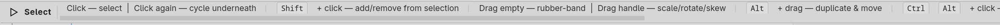

# Context bar

The context bar is the thin horizontal strip directly above the
canvas. It shows two things: which tool is active, and a quick-
reference hint strip for that tool's modifiers and behaviour.

The context bar is read-only — there are no controls on it. It is a
glanceable cheat-sheet for the active tool, intended to remind you
of the shortcuts for whatever you are about to do without forcing a
trip to the keyboard-shortcuts dialog.

## Anatomy

- **Left** — the tool's glyph and name. The glyph matches the
  toolbar icon for that tool; the name is the human-readable label
  ("Select", "Node", "Pen", and so on). Both update the moment you
  switch tools.
- **Centre** — the hint strip. This is a horizontally-scrolling
  list of short tips and modifier keys, separated by vertical
  rules. Each tool has its own set; the list rebuilds whenever you
  change tools.

The hint strip never grows past the bar's width — if you have
narrowed the window enough that the hints don't fit, the strip
scrolls horizontally to show the rest.

## What the hints look like

Hints come in two visual flavours:

- **Plain text** — describes a behaviour. "Click to select." "Drag
  — rubber-band select." "Stroke width set in Properties."
- **Key tags** — small bordered labels showing a modifier or
  keystroke, like `Shift` or `↑↓←→`. These are the inputs you can
  use while the tool is active.

The two flavours interleave to form sentences: `Shift` + click —
add to selection. `Alt` + drag — duplicate and move.

## What's not on the context bar

The context bar is **not a settings strip**. The Rectangle tool's
corner radius, the Ellipse tool's start/end angle, the Polygon
tool's side count — none of those live here. They live on the
**Object** group of the inspector once you've placed the shape (see
5.4) or in the right-click dialog of the shape tool itself (see
4.4.x).

This is a deliberate split: the context bar is for muscle memory —
the modifiers you press *while drawing* — and the inspector is for
parameters — the values you tweak *after drawing*. Keeping them
separate stops the canvas-side strip from cluttering during a
drag-out.

## Where to next

- **Toolbar** (3.3) is the column you click to switch tools; the
  context bar reflects whichever tool is selected there.
- **Tools** (Chapter 4) covers each tool in depth — the per-tool
  pages are where the full behaviour and any inspector parameters
  live.
- **Status bar** (3.5) sits at the opposite (bottom) edge of the
  canvas and reports cursor position, zoom, and selection counts.
