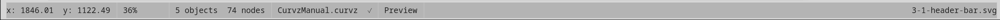

# Status bar

The status bar runs across the bottom of the window and reports
read-only state about the project, the active document, and the
cursor. It is never the place you go to *change* something — every
value here is settable somewhere else in the UI.

## Readouts, left to right

- **Cursor position** — the X and Y coordinates of the pointer in
  document units, updated as you move the pointer over the canvas.
  Format is `x: 12.34  y: 56.78`. Coordinates honour the ruler
  origin (so if you've moved the origin via the corner square, the
  readout shows the user-space value, not the canvas-relative one).
  See **Canvas, rulers & corner** (3.6) for the origin model.
- **Zoom percentage** — the current canvas zoom level, shown as
  `1600%` for 16×, `100%` for 1:1, and so on. Updates live as you
  zoom.
- **Document units** — the abbreviation of the active document's
  unit (`px`, `mm`, `in`, `pt`). This is the unit the cursor-position
  and object-bounds readouts are expressed in, set in the Dimensions
  section of the inspector (5.3.2).
- **Object and node counts** — the number of objects and the total
  number of nodes in the current selection. Format is
  `3 objects  18 nodes`. With nothing selected the counts read
  `0 objects  0 nodes`. Pluralisation handles itself.
- **Render mode** — `Preview` or `Outline`. See chapter 10.1 for
  the difference.
- **Project name** — the directory name of the loaded project, or
  `unsaved` if the project has never been saved.
- **Active document name** — right-aligned at the far right of the
  bar. Shows the active document's filename without its `.svg`
  extension. Shifts as you switch tabs.

The right-aligned document name claims any spare horizontal space
in the bar, so the left-side readouts stay tightly grouped near
the bottom-left corner where you naturally read them.

## What the status bar doesn't show

- **Selected object name** — selection details live on the
  inspector's Object group (see 5.4), not the status bar. The
  status bar only counts.
- **Tool name** — that lives on the **Context bar** (3.4) at the
  top of the canvas.
- **Save state** — Curvz does not display a "modified" dot or
  asterisk in the status bar today. Saves are project-wide; if you
  changed something since the last save, **Ctrl+S** writes
  everything back.

The deliberate omission is to keep the status bar at a glance —
seven quick readouts, no scanning.

## Where to next

- **Canvas, rulers & corner** (3.6) explains the coordinate system
  the cursor-position readout reflects.
- **Inspector overview** (5.1) covers where everything that *isn't*
  in the status bar reports its current state.
- **Selection** (5.4.1) — the inspector section that names the
  selected objects' geometry, paint, and bounds.
