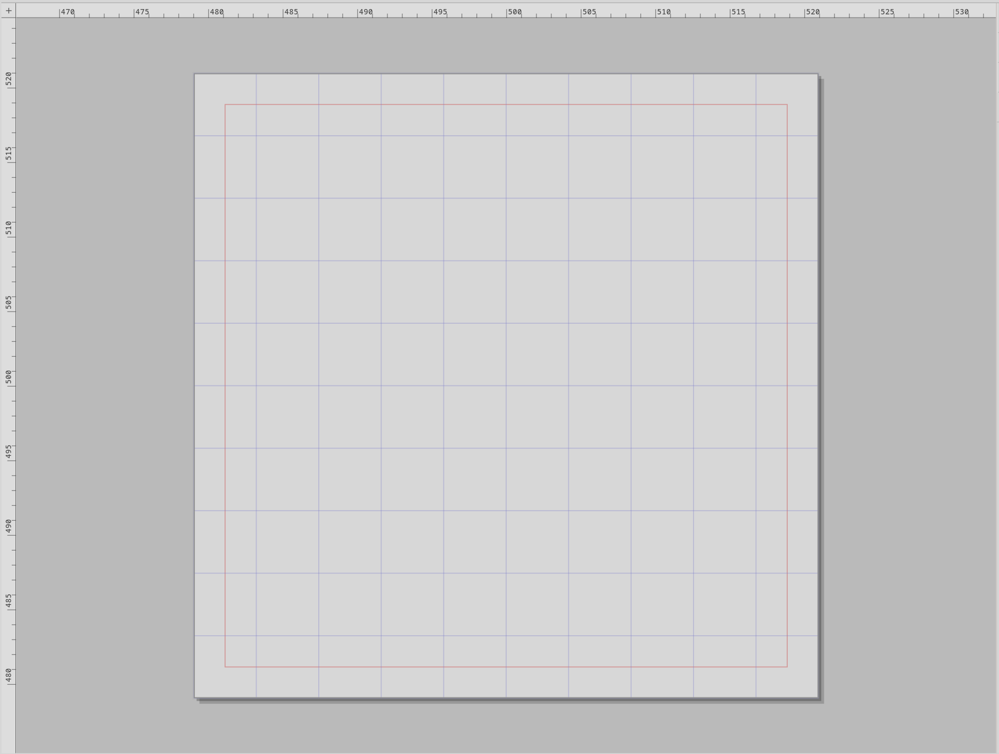

# Canvas, rulers, and corner

The canvas is the largest part of the window — the actual drawing
surface — framed by rulers along its top and left edges, with a
small square in the corner where the two rulers meet.

## The canvas

The canvas is divided into two regions:

- **Artboard** — the rectangle that represents the document's
  printable extent. This is what gets exported. The artboard's
  fill colour is whatever Motif sets (see 5.2.1).
- **Pasteboard** — everything outside the artboard, but still
  inside the canvas viewport. The pasteboard is scratch space —
  put work-in-progress here, anything outside the artboard does
  not get exported. The pasteboard's tone is also Motif-driven.

The artboard's size is set per-document in the inspector's Canvas
section (5.3.2). You can drag objects freely between artboard and
pasteboard; nothing about an object's appearance changes — the
distinction is purely about what crosses the export boundary.

## Coordinate system

Curvz uses a **Y-up** coordinate system with the origin at the
artboard's lower-left corner. X increases to the right, Y
increases upward, both starting at zero in the bottom-left. This
matches engineering and mathematical convention; it's the opposite
of the screen-space Y-down convention you'd see in most raster
tools.

You can move the origin away from the bottom-left corner — see
the **Corner square** below.

## Rulers

A ruler runs along the top edge of the canvas and another down the
left edge. They show units in user space — that is, with whatever
ruler origin you've set, not the artboard-relative position. Tick
marks scale with the zoom level: zoom in and the rulers subdivide
into finer increments; zoom out and they coarsen.

Toggle the rulers off with **Ctrl+R** or **View → Rulers**. Curvz
remembers the toggle across sessions.

### Drag a guide out of a ruler

Drag from the body of a ruler into the canvas to place a guide.

- Drag from the **top** ruler downward → places a horizontal guide.
- Drag from the **left** ruler rightward → places a vertical guide.

Release to commit the guide at that position. While dragging, a
preview line tracks your cursor. Guides lock to whatever snap
behaviour is active (see 5.3.6).

Once placed, guides can be moved, locked, or deleted from the
inspector's Guides section (5.3.3).

## Corner square

The square where the two rulers meet is the **corner square**. It
controls the **ruler origin** — the point both rulers consider to
be (0, 0).

Three interactions:

- **Drag** from the corner square outward into the canvas. As you
  drag, a preview crosshair shows where the new origin will land
  in user space. Release to commit. Drags shorter than 4 pixels are
  treated as accidental and ignored.
- **Double-click** the corner square to reset the origin to (0, 0)
  — that is, back to the artboard's lower-left corner.
- **Right-click** the corner square to open the **Ruler Origin**
  popover, which gives you numeric X / Y entry for setting the
  origin precisely.

The ruler origin only affects what the rulers and the status bar's
cursor readout display. It does not move objects, change the
artboard, or affect what gets exported. Treat it as a measurement
convenience — set it to whatever local zero makes the geometry
you're working on read most cleanly.

## Render mode

The canvas has two render modes:

- **Preview** mode shows fills, strokes, gradients, blurs, and
  drop shadows — the document as it will export.
- **Outline** mode shows only path skeletons. No fills, no
  strokes — just the curves themselves and the node positions.
  Useful for precision editing on busy artwork where the painted
  result obscures the geometry.

Toggle with **Ctrl+E** or **View → Outline Mode**. The status bar
shows which mode is active. The toggle is project-wide and
persists across sessions.

## Where to next

- **Status bar** (3.5) reports the cursor position the rulers
  reflect.
- **Canvas section** (5.3.2) sets the artboard's dimensions.
- **Guides** (5.3.3) — once you've dragged guides out of the
  rulers, this is where you manage them.
- **View options** (10.1) covers all view-related toggles in one
  place.
