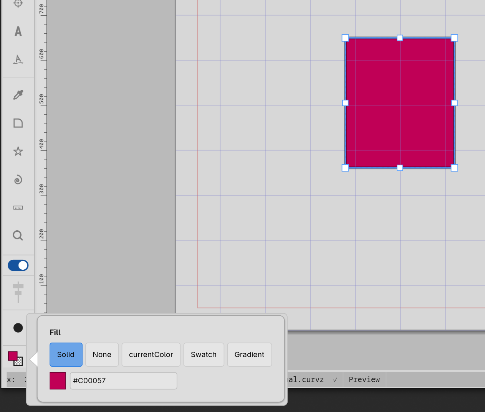

# Color picker and paint editor

Curvz has one colour picker that pops up wherever a colour value
needs choosing — the Canvas chips in the Theme disclosure, the
Styling fill and stroke swatches, guide / grid / margin colours,
swatch creation in the Swatches panel, style editing. The same
widget lives behind every one of those entry points.

The **paint editor** is the wider widget around the picker. It adds
type selection (Solid / None / currentColor / Swatch / Gradient)
and binding controls — the things a paint can be that aren't just
"a colour."

## Opening the picker

The picker is always invoked the same way: click the small colour
chip on whatever surface holds it. The chip is filled with the
current colour; clicking it opens the popover anchored to the chip.

The picker dismisses itself on:

- **Click outside** — commits whatever you've done.
- **Esc** — cancels and reverts to the colour you started with.
- **Enter in the hex field** — commits and dismisses.
- **Click on a recent swatch** — applies that swatch and dismisses.

While open, every change you make is **live-previewed** on the
underlying chip and any artwork the chip is bound to. The "commit"
just makes the live preview permanent; "cancel" is what reverts it.

## Picker anatomy

The popover has four surfaces, top to bottom:

- **Hue strip** — a tall vertical slider on the right of the
  spectrum, showing the full hue circle. Click or drag along it to
  pick a hue (0–360°).
- **Chroma / lightness spectrum** — the large square area to the
  left of the hue strip. At the current hue, it samples a 2D grid
  with chroma on the X axis and lightness on the Y axis. Click or
  drag inside it to pick those two values. Areas past the sRGB
  gamut are clamped at the edge — you'll see a "shoulder" in
  highly chromatic regions.
- **Alpha slider** — a horizontal slider below the spectrum,
  shown only when the picker was opened with alpha enabled.
  Surfaces that don't accept transparency (like a Canvas chip
  in the Theme disclosure) open the picker without alpha.
- **Hex entry + preview swatch** — a hex value field and a
  preview chip showing the new colour over the original on a
  diagonal split. Type a hex value (with or without `#`) and
  press Enter to commit.

Below the popover, a strip of **recent colours** shows up to a
dozen colours you've used recently across all pickers in the app.
Click any to apply it.

The picker uses **OKLCH internally** for the hue/chroma/lightness
math, then converts back to sRGB for storage. This gives a more
perceptually-uniform spectrum than the HSL colour wheel you may be
used to — the gradient you see when scrubbing the lightness axis
looks visually linear rather than getting compressed at the dark
end.

## Paint editor

When the picker is opened from a surface that supports more than
just "a single solid colour" — typically the inspector's
Styling section — the picker is wrapped in a wider **paint
editor**. The paint editor adds:

- **Type toggle** — a row of buttons selecting what kind of paint
  this is:
  - **Solid** — a literal RGB(A) colour. The picker is the editor.
  - **None** — no paint at all (no fill, or no stroke). The
    picker hides itself.
  - **currentColor** — the paint comes from the rendering theme,
    not from a fixed colour. Critical for icon work — see
    **currentColor and symbolic icons** (9.2).
  - **Swatch** — the paint references a named entry in the
    project's swatch library. Editing the swatch later updates
    every object bound to it.
  - **Gradient** — a linear or radial gradient. Picks open the
    Gradient editor (a separate dialog).
- **Hex entry** — the same hex field as the picker, exposed
  outside the popover so you can type a value without opening the
  popover at all.
- **Swatch picker** — visible only when **Swatch** is the selected
  type. Shows a palette dropdown and a chip grid; click a chip to
  bind the paint to that swatch. A bound paint shows the swatch
  name in italic next to the chip, with an `×` button to unbind.
- **Gradient ramp** — visible only when a gradient is the selected
  type. Shows a horizontal preview of the gradient and an "Edit…"
  button that opens the gradient editor.

The paint editor's structure rebuilds when you change types — for
example, switching from Swatch to Solid hides the swatch picker
and exposes the colour chip and hex field. The visible colour
preview is always the *resolved* paint — what the object will
actually paint with — regardless of which type produced it.

## Where to next

- **Theme disclosure** (5.3.8) is the simplest entry point to
  the picker — three Canvas colour chips (artboard, workspace,
  creation) with no alpha and no paint-type toggle.
- **Styling** (5.4.5) is where the paint editor lives in its
  fullest form, with both fill and stroke slots.
- **Swatches** (6.4) — the palette the Swatch type binds to.
- **currentColor and symbolic icons** (9.2) — why the
  currentColor type exists and when to reach for it.
- **Themes** (9.1) — for packaging up colour decisions.
