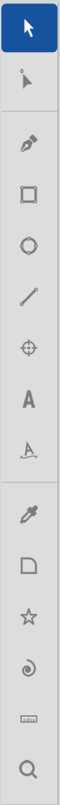

# Tools overview

The **toolbox** runs down the left edge of the window and holds
fifteen tools — every drawing, editing, and navigation surface you
need to draw an icon. This page is the one-paragraph rundown of
each tool, grouped the way the toolbox itself groups them, with
pointers into the deep-dive topics.

If you want to know **how the toolbox itself looks and behaves**
(active state, hover tooltips, the fill/stroke well at the bottom)
see **Toolbar** (3.3). This page is about what the tools *do*.

The toolbox is split into four sections, separated by thin
horizontal lines: **Selection** at the top, then **Creation**,
**Transforms**, and **Utility**. The fill/stroke well sits below
the tool list at the bottom of the column.

## Selection

Two tools at the top — the ones you reach for most often.
Together they cover "pick something" and "edit it."

- **Selection (S)** — pick whole objects, move them, drag the
  bounding-box handles to scale, and press R to enter pivot mode
  for rotation. Multi-select with Shift+click or marquee. See
  **Selection tool** (4.2.1).
- **Node (N)** — pick individual anchors and handles on a path,
  drag to recurve, double-click a segment to insert a node. The
  companion to the Pen for editing whatever you have already
  drawn. See **Node tool** (4.2.2).

## Creation

Nine tools that *make new artwork*. The Pen builds paths anchor
by anchor; the five shape tools (Rectangle, Ellipse, Line,
Polygon, Spiral) are parametric — drag-to-draw on the canvas, or
right-click the tool button to place at exact dimensions via a
dialog. Reference Point and the two Text tools also live here
because they introduce new objects.

- **Pen (P)** — click to drop nodes one at a time, dragging at
  each click to extend the handles for a curved segment. Click
  the first node again to close the path, or press Escape to
  leave it open. See **Pen** (4.3).
- **Rectangle (R)** — drag a rectangle. Hold Shift to constrain
  to a square. See **Rectangle** (4.4.1).
- **Ellipse (E)** — drag an ellipse. Hold Shift for a circle.
  See **Ellipse** (4.4.2).
- **Line (L)** — drag a straight line between two points. See
  **Line** (4.4.3).
- **Reference Point (F)** — drop a non-printing reference point.
  Refs survive in the document but are stripped from exports.
  Useful for alignment hubs, registration marks, and design
  notes. Right-click the tool button for precise placement. See
  **Reference points** (4.7).
- **Text (T)** — click to place a text cursor, type the run.
  Switch tools to commit. Right-click the tool button for text
  options. See **Text** (4.5.1).
- **Text on Path (U)** — attach an existing text run to an
  existing path so the type follows the curve. See **Text on
  Path** (4.5.2).
- **Polygon / Star (G)** — drop a regular polygon or star.
  Right-click the tool button to configure sides and star
  options. See **Polygon** (4.4.4).
- **Spiral (W)** — drop a parametric spiral. Right-click the
  tool button to configure windings. See **Spiral** (4.4.5).

## Transforms

Six entries that *modify the selection rather than create new
artwork*. Most open a popover or a hub dialog; **Corner** is the
exception — it's a node-modifier tool with its own toolbox button
and hotkey.

- **Align** — distribute or align the current selection (left,
  centre, right, top, middle, bottom). See **Align and
  distribute** (7.4).
- **Blend** — make, edit, or release a blend between two paths.
  See **Blends** (7.3).
- **Boolean** — Union / Subtract / Intersect on two or more
  paths. See **Boolean operations** (8.2).
- **Corner (K)** — apply round, chamfer, or inverse-corner
  treatments to selected nodes on a path. The only Transforms
  entry that's a true tool with a hotkey. See **Corner** (4.8).
- **Step & Repeat** — duplicate the selection along a grid or
  path. See **Step and repeat** (7.1).
- **Warp** — make, edit, or release a Warp container that
  envelope-distorts its child geometry. See **Warp** (7.6).

The Transforms entries other than Corner aren't single-letter
hotkey tools — they're toolbar buttons that open a popover or run
a verb on the current selection. See **Toolbar** (3.3) for the
section's layout.

## Utility

Three tools that don't draw new artwork — they support the
workflow around the artwork you have.

- **Eyedropper (I)** — sample a colour from anywhere on the
  canvas and apply it to the current selection. Alt while
  clicking applies to stroke instead of fill. One-shot — Curvz
  restores the previous tool after a sample. See **Eyedropper**
  (4.6.1).
- **Measure (M)** — measure distance and angle between two
  snapped points. Two clicks complete a measurement;
  right-click the tool button to configure measurement
  behaviour. See **Measure** (4.6.3).
- **Zoom (Z)** — drag a marquee to zoom into a region, or click
  to zoom in. Alt+drag zooms out. Right-click the tool button
  to set a precise zoom percentage. See **Zoom** (4.6.2).

## Tool switching at a glance

Every tool has a single-letter shortcut shown above. The keys only
fire when the canvas has focus — if a spin button or text entry
has focus, the same letter types into that field. Click the canvas
once or press **Esc** to return focus first.

When nothing is selected, **↑** / **↓** cycle through the toolbox
(previous / next tool). With a selection, the arrows nudge the
selection instead.

The Selection tool is the implicit default. After most one-shot
operations — Eyedropper sample, Zoom click, Measure complete —
Curvz returns you to whichever tool you were on before. It's
designed so quick interruptions don't leave you stranded in the
wrong tool.

## Right-click on a tool button

Most tools — Rectangle, Ellipse, Line, Reference Point, Text,
Polygon, Spiral, Measure, Zoom — open a parameter dialog or
options popover when you right-click their toolbox button. Use
it for exact dimensions, side counts, windings, text options,
measurement behaviour, or zoom percentages without dragging on
the canvas.

The right-click affordance is shown in the tool's hover tooltip.
Tools without a right-click dialog do nothing on right-click.

## The fill/stroke well

Below the tool list, near the bottom of the toolbox, are two
colour squares — the **fill well** and the **stroke well**. These
show the active paint pair and are clickable: click either to
edit the corresponding paint with the popover editor.

The wells are a quick-access mirror of the **Styling**
inspector section (5.4.5). Picking from the well applies to the
current selection if there is one; otherwise it sets the default
paint for the next object you draw.

## Where to next

Each tool has its own deep-dive page (4.2.1 through 4.8). For the
toolbox container itself — its visual layout, the active-tool
highlight, the orientation of the fill/stroke well — see
**Toolbar** (3.3).

If you are starting from scratch and want a guided first walk
through the tools, the order roughly matches the page order: pick
a shape tool to draw something, switch to the Selection tool to
move it, switch to Node to refine its anchors, then to Pen for
custom shapes that don't fit a parametric.
