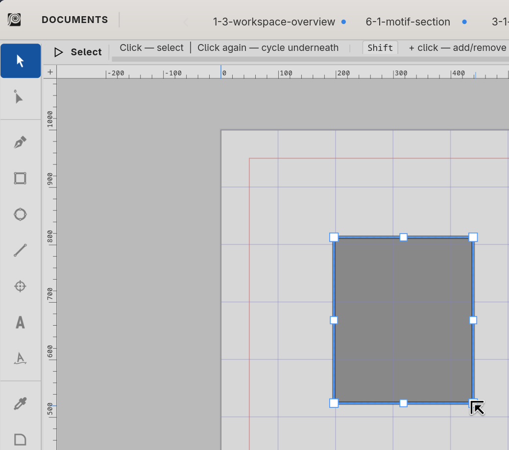

#  Selection tool

The **Selection tool** picks whole objects, moves them, and gives
you the bounding-box handles for visual scaling and rotation. It's
the default tool — the one Curvz returns to after most one-shot
operations like an Eyedropper sample or a Zoom drag.

Activate it from the toolbox or with the **S** key (canvas focus
required). The cursor is a regular arrow over empty space and
changes shape over selection handles.

## What clicks do

The Selection tool's behaviour is gesture-driven. The same click
means different things depending on what's under the cursor and
which modifier keys are held:

- **Click on an unselected object** — replaces the selection with
  that object. Curvz picks the topmost hit at the click point.
- **Click on a selected object** — keeps the selection and starts
  a drag (move).
- **Click on empty canvas** — clears the selection and starts a
  marquee.
- **Drag from empty canvas** — marquee selects every object
  whose bounding box the marquee crosses.
- **Drag a bounding-box handle** — scales the selection (corner
  handles, edge midpoints) or rotates it (in pivot mode, see
  below).

The marquee is a rubber-band rectangle. Release the drag and
every object whose bounding box intersects the marquee enters the
selection.

## Multi-select

Three ways to build a multi-object selection:

- **Shift + click** — toggles the clicked object in or out of the
  current selection. The most recently clicked object becomes
  the **primary**, which is what the inspector's Object section
  (and any "anchor" operation) acts on.
- **Marquee from empty canvas** — drag a rectangle across
  multiple objects.
- **Shift + marquee** — accumulates marquee picks into the
  existing selection rather than replacing it.

For multi-select transforms — recolour, move, scale, distribute —
the Inspector's **Selection** section (5.4.1) and **Appearance**
section (5.4.5) broadcast changes to every object in the set as
single composite undo steps.

## Click-through into groups and stacks

By default a click on a group or compound path picks the *whole
container*. Two modifiers let you reach inside:

- **Ctrl + click** — cycles "select-behind." When a single object
  is currently selected and you click on it, Ctrl + click picks
  the next object underneath at that point. Repeat to cycle
  through the stack at the click point. Useful when overlapping
  objects make a back layer hard to reach.
- **Alt + click on the canvas** is reserved for the duplicate-
  in-place drag (see below). To pick into a group, use the
  **Layers** panel (6.2) and click the inner object there
  instead.

## Modifier-drag idioms

A handful of click-and-drag combinations are worth knowing:

- **Drag** — move the selection. Snap targets engage if Snap
  (5.3.6) is on. Hold **Shift** mid-drag to constrain motion to
  the closest axis (horizontal or vertical only).
- **Alt + drag** — duplicate in place, then drag the duplicate.
  The original stays put; the new copies follow the cursor. Push
  one Ctrl+Z to remove the duplicates.
- **Drag a corner handle** — scale around the opposite corner.
  Hold **Shift** to scale uniformly.
- **Drag an edge-mid handle** — scale along that one axis.
- **Right-click drag** — pan the canvas (also: hold **Space** and
  drag with left-button).

Bounding-box handles only appear when something is selected. With
nothing selected, drag-from-empty starts a marquee instead.

## Pivot mode (R)

Press **R** while the Selection tool is active and something is
selected to enter **pivot mode**:

- A pivot crosshair appears at the bounding-box centre. Drag it
  to a different position on the canvas to set a custom pivot.
- The four corner scale handles become **rotate handles** in
  pivot mode — drag any one to rotate the selection around the
  pivot.
- Edge-midpoint handles are inactive in pivot mode.

Press **R** a second time to exit pivot mode. The selection
returns to the regular scale-handle layout.

The custom pivot persists until you exit pivot mode or change the
selection. For numeric rotation, the inspector's **ROTATE**
spinner (5.4.1) is usually faster.

## Double-click on a text object

Double-clicking a text node with the Selection tool **enters
text-edit mode** — Curvz switches to the Text tool (T) and places
a cursor in the text. Quicker than tool-switching manually when
you just need to fix a typo.

For other node types, double-click is currently a no-op. Future
work may add "double-click a path to enter Node tool" but it is
not in today.

## Right-click

Right-clicking with the Selection tool opens a small **context
menu** at the click point, with verbs that apply to whatever was
hit:

- **Path / group / compound / clip group / blend / image / text**
  — at minimum a "Save to Library…" entry; some types add
  type-specific entries (rebuild blend steps, image-info dialog,
  etc.).
- **Empty canvas** — currently a no-op.
- **Reference points and guides** have their own targeted menus.

For document-level verbs, use the application menu (☰) at the
right end of the title bar instead.

## Where to next

The companion tool is **Node** (4.2.2) — once an object is
selected with the Selection tool, switch to Node to edit its
anchors and handles individually.

For numeric editing of a selection's position, size, and
transforms, use the inspector's **Selection** section (5.4.1).
For appearance edits, **Appearance** (5.4.5).

### Keys

These bindings only fire when the canvas has focus and the
Selection tool is active.

- `S` — switch to Selection tool (anywhere in the toolbox).
- `←` / `→` / `↑` / `↓` — nudge the selection by about 2 screen
  pixels.
- `Shift + arrow` — medium nudge, about 8 screen pixels.
- `Alt + arrow` — large nudge, about 32 screen pixels.
- `Ctrl + arrow` — reserved for arrange operations.
- `R` — toggle pivot mode (when something is selected).
- `Delete` / `Backspace` — delete the selection. Guides take
  priority: with guides selected, Delete removes those first.
- `Esc` — clear the selection (or exit the current marquee /
  pivot mode).

The arrow nudge applies to refpoints and text/image nodes the
same way it applies to paths. With a Warp container selected and
envelope picks active, arrows nudge the picks instead.
