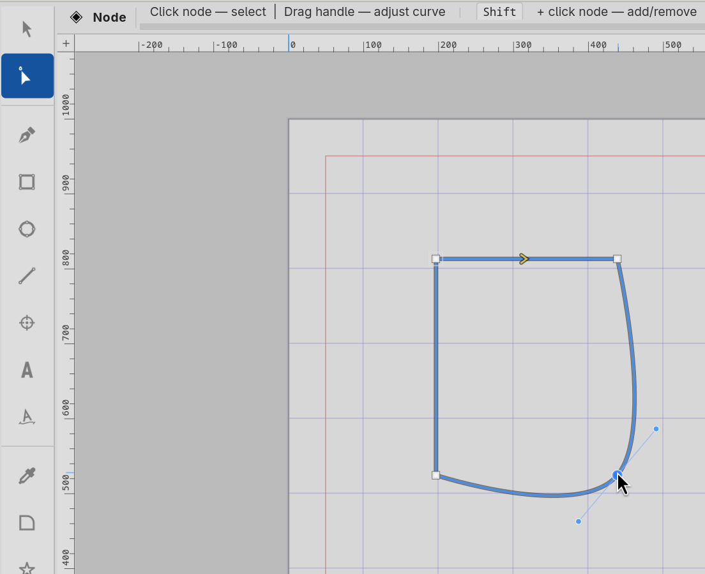

#  Node tool

The **Node tool** is for editing whatever you have already drawn —
moving anchors, adjusting handles, inserting and deleting nodes,
opening and closing paths, joining two paths together. Where the
Pen tool *creates* path geometry, the Node tool *refines* it.

Activate it from the toolbox or with the **N** key (canvas focus
required). When active, the canvas shows every anchor on the
selected path as a small marker — the type marker reflects the
node's classification (◆ Symmetric, ◇ Smooth, □ Cusp, ○ Corner).
Selecting a node also reveals its handle markers, drawn as smaller
discs connected to the anchor by thin lines.

## Anchors and handles

Every node on a Curvz path has three things you can manipulate:

- The **anchor** — the on-curve position where the path passes
  through.
- The **inbound handle** (`cx1`, `cy1`) — the control point
  shaping the curve coming *into* the anchor.
- The **outbound handle** (`cx2`, `cy2`) — the control point
  shaping the curve going *out* of the anchor.

The relationship between handles and anchor is governed by the
node's **type** (Symmetric, Smooth, Cusp, Corner — see 5.4.4).

For numeric editing, the **Node** inspector section (5.4.4) gives
spin buttons for all six values plus a type dropdown. The Node
tool itself is for direct on-canvas manipulation.

## What clicks do

Like the Selection tool, the Node tool's behaviour depends on
what's under the cursor:

- **Click an anchor** — selects that node. Drag to move it; the
  handles travel with the anchor.
- **Click a handle** — selects and drags just the handle, leaving
  the anchor in place. Reshapes the curve.
- **Click on a curve segment** (between two anchors) — **inserts
  a new node** at the click point. The path's shape is preserved
  — Curvz computes the handles needed for the new node to lie on
  the existing curve.
- **Click on an unselected path** — selects that path. From here
  click an anchor or segment to start editing it.
- **Click on empty canvas** — starts a marquee that selects every
  anchor inside it (across all paths it crosses).

Double-clicking a segment also inserts a node — both the single
and double click go through the same insert path.

## Multi-node selection

Curvz lets you select **many nodes at once**, even across
different paths:

- **Shift + click an anchor** — toggles that node in or out of
  the multi-selection. The most recently clicked node becomes
  the primary.
- **Shift + click a path body** — adds *every* anchor of that
  path to the selection (or removes them all if they were
  already in).
- **Marquee from empty canvas** — selects every anchor inside
  the rectangle, across every path crossed.

Multi-node selection makes the inspector's **Type** dropdown
broadcast — picking Smooth applies the type to every selected
node. Arrow-key nudges and Delete also operate on the whole set.

## Modifier idioms

Beyond shift-click, a handful of useful gestures:

- **Drag an anchor** — moves it. The path reshapes; the rest of
  the path is unaffected.
- **Drag a handle** — adjusts curvature. Handle behaviour depends
  on node type — Symmetric mirrors the other handle, Smooth
  keeps it collinear, Cusp/Corner leave the other alone.
- **Retract a handle** — two ways. Press **Ctrl + Left** to
  retract the **IN** handle (`cx1`, `cy1`) to the anchor, or
  **Ctrl + Right** to retract the **OUT** handle (`cx2`, `cy2`)
  to the anchor. Either produces a perfectly straight segment
  on that side. Symmetric nodes retract both handles regardless
  of which side you press — the node type's invariant requires
  it. You can also click the **IN** or **OUT** row label in the
  inspector's **Node** section (5.4.4) for the same effect.

## Path-state actions (J, B, R)

Three single-key actions change the path's overall topology
rather than individual nodes. They are most efficient as keys but
all have inspector-button equivalents in the **Node** section
(5.4.4) too:

- **J — Close / Open / Join.** Context-aware:
    - With a single open path selected, J closes it (welds head
      to tail if they're coincident, otherwise bridges with a
      straight segment).
    - With a single closed path selected, J opens it at the
      current node — duplicates the node so the closing segment
      becomes explicit.
    - With one node selected on each of two open paths, J joins
      them into a single open path. Curvz orients them so the
      tail of one connects to the head of the other.
- **B — Break / Split.** Routing depends on the path state:
    - Open path → splits into two separate objects at the
      selected node.
    - Closed path → opens the loop at the selected node, leaving
      one path with explicit endpoints.
- **R — Reverse direction.** Flips the path's traversal direction
  (clockwise ↔ counter-clockwise). The selected node index
  re-maps so the same anchor stays selected.

The **Type** keys (A, M, C, K) set the type of the selected node
or every node in the multi-selection — see the Keys section below
for the mapping.

## Cycling nodes with Tab

Press **Tab** to cycle to the next node on the current path,
**Shift + Tab** for the previous. Useful for stepping through a
path systematically — the inspector's **Node** section header
shows the current index in the form `Node  3 / 12` so you always
know where you are.

Tab cycles within the selected path only. To jump to a different
path, click that path first. **Ctrl + Tab** is reserved for
document navigation at the window level — it cycles document tabs,
not nodes.

## Restrictions for blends

When a path is the **A** or **B** source of a Blend container,
its node count is **locked** — Curvz needs A and B to share a
node count for the interpolation maths to work. The Node tool
will refuse to insert or delete a node on a blend source and pop
a small message dialog explaining why. Release the blend (5.4.3)
first, edit, then re-blend.

The handle adjustments and anchor moves are unrestricted — only
operations that change the node *count* are gated.

## Right-click

Right-clicking on the canvas while the Node tool is active —
with a path selected and at least one node picked — opens a
small **node context menu** at the click point. The menu mirrors
the most common node-tool keys so you can reach the same verbs
without leaving the mouse:

- **Join or Close (J)** — close the path if open, open it if
  closed, or join two open paths if one node on each is
  selected.
- **Break Path (B)** — break the path at the selected node.
- **Make Symmetric (A)**, **Make Smooth (M)**, **Make Cusp (C)**,
  **Make Corner (K)** — set the type of the selected node(s).

The menu dispatches through the same handlers as the keys, so
blend-source rejection, atomic undo wrapping, and the explanatory
error dialogs all behave identically whether you used the menu
or the keypress.

## Where to next

The companion creation tool is the **Pen** (4.3) — once you've
drawn a path with the Pen, switch to the Node tool to refine it.

For numeric editing of a single node's coordinates, the
inspector's **Node** section (5.4.4) gives all six fields (anchor,
in-handle, out-handle) plus the type dropdown.

For path-level structure operations beyond what the Node tool
covers — boolean operations, compound paths, step-and-repeat —
see **Path operations** (8) and **Working with objects** (7).

### Keys

These bindings only fire when the canvas has focus and the **Node
tool** (N) is active. They mirror the inspector's Node-section
keys exactly.

- `N` — switch to Node tool (anywhere in the toolbox).
- `A` — set node type to **Symmetric**.
- `M` — set node type to s**M**ooth.
- `C` — set node type to **Cusp**.
- `K` — set node type to corner (**K**ink).
- `R` — reverse the path's direction.
- `J` — close the path if open, or open the path if closed. With
  one node selected on each of two open paths, joins them.
- `B` — break the path at the selected node. Open path → splits
  into two; closed path → opens at the node.
- `Tab` / `Shift + Tab` — cycle through nodes on the current
  path.
- `Ctrl + Left` — retract IN handle on the selected node(s) to
  the anchor.
- `Ctrl + Right` — retract OUT handle on the selected node(s) to
  the anchor. Symmetric nodes retract both handles regardless of
  which side you press.
- `Delete` / `Backspace` — delete the selected node. The path's
  curvature smooths across the gap.
- `←` / `→` / `↑` / `↓` — nudge the selected node by about 2
  screen pixels. `Shift` = 8 px, `Alt` = 32 px. `Ctrl + Up` /
  `Ctrl + Down` are reserved for arrange operations.

The letter keys also accept their lowercase form. If a spin
button has focus, letters type into the spinner; click the canvas
once or press **Esc** to return focus before pressing a tool key.
