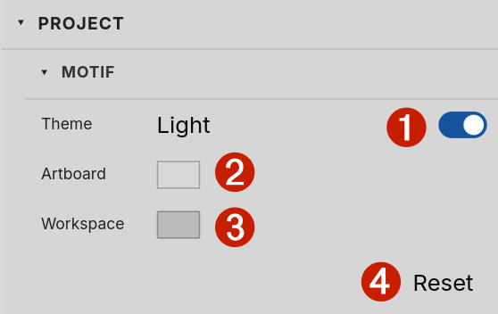

# Motif

The first section in the inspector is **Motif** — your project's
workspace appearance. Motif controls how Curvz looks while you are
editing this project: the application theme, the colour of the
artboard the icon sits on, and the colour of the workspace around it.

Motif is purely an editing-time setting. None of these values reach
the icon you export — they only affect what you see while drawing.

## ❶ Theme

The **Theme** row ❶ toggles between Dark and Light. Tapping the switch
flips the application's chrome — panels, dialogs, the inspector
itself — between the two CSS forks. The switch shows the current
theme as a label beside it.

Pick whichever reads more comfortably. Curvz ships with sensible
defaults for both, and the icon you draw is identical either way.
Light mode is conventional for documentation and screenshots; dark
mode is the default for editing sessions.

## ❷❸ Artboard and Workspace

Below Theme are two colour swatches:

- **Artboard** ❷ sets the colour of the rectangle your icon sits on —
  the printable extent of the document.
- **Workspace** ❸ sets the colour of the area surrounding the artboard
  — the pasteboard region where you can park work-in-progress
  outside the export bounds.

Click either swatch to open the colour picker. See **Color picker &
paint editor** (3.7) for the picker itself; the change is immediate —
Curvz repaints the canvas as you adjust the colour.

## Per-theme colour memory

Curvz keeps **separate artboard and workspace colours for each
theme**. If you set a particular pair while in Dark mode, then flip
to Light and pick different colours there, both customisations are
remembered. Flipping back to Dark restores the dark-mode pair you
chose; flipping to Light restores the light-mode pair.

This matters because the colour that reads well as an artboard tint
depends on the surrounding chrome. A medium grey that lifts an icon
nicely on a dark panel can feel sunken on a light one. Letting each
theme keep its own pair means you tune both surfaces once and never
have to re-pick when toggling.

The defaults are deliberately neutral greys in both themes — Curvz
is not a "paper" editor, so light mode does not assume white. You
get a working surface, not a printed page.

## ❹ Reset

The **Reset** button ❹ at the bottom of the section restores the
*current theme's* artboard and workspace pair to Curvz's defaults.
It does not touch the other theme's pair, and it does not flip the
theme itself. Use it when you have over-tuned one mode and want a
clean baseline back without disturbing your work in the other mode.

## Project scope

Motif is a **project-level** setting, not a document-level one.
Every document in the same project shares one motif, one artboard
colour, and one workspace colour per theme. Switching between
documents in the same project never flickers the canvas tone — they
all sit on the same surface.

A different project can carry a different motif. The setting is
saved in `project.json` at the project root, alongside the document
list.

## Where to next

Motif is the first of the inspector's appearance categories. The
ones that follow control how individual icons are painted rather
than how the editing surface looks:

- **Appearance** (5.4.5) covers per-object fill and stroke paints.
- **Swatches** (6.4) covers the project's named colour library.
- **Themes** (9.1) covers how Curvz packages full appearance presets
  you can apply across projects.

If you want to change render mode (Preview vs. Outline) or toggle
rulers, those live under **View options** instead — see 10.1.
